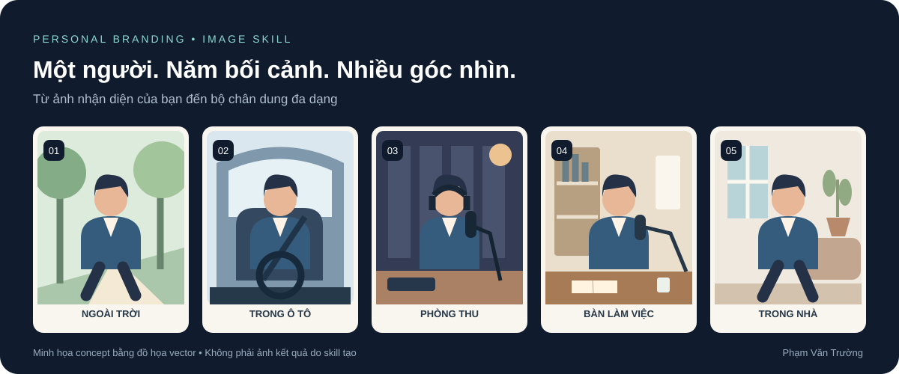
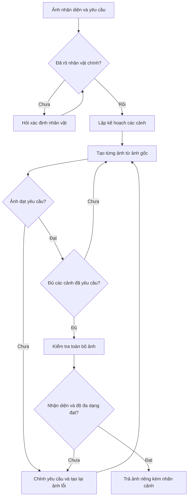
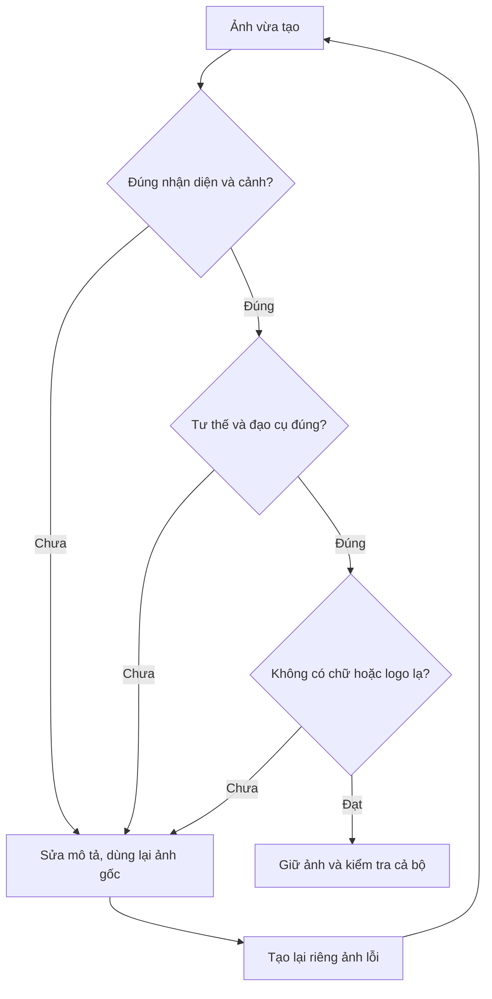

<div align="center">

# 📸 TẠO BỘ ẢNH THƯƠNG HIỆU CÁ NHÂN

### Một người · Năm bối cảnh · Nhiều góc nhìn

Từ ảnh khuôn mặt bạn cung cấp, tạo bộ chân dung phục vụ nội dung cá nhân, podcast và chia sẻ chuyên môn.

**5 ảnh riêng biệt** &nbsp; • &nbsp; **Khung dọc 4:5** &nbsp; • &nbsp; **Phong cách chân thực**

[📖 Xem skill](anh-tao-bo-anh-thuong-hieu-ca-nhan/SKILL.md) · [🚀 Bắt đầu](#-bắt-đầu-với-3-bước) · [💬 Câu-lệnh-mẫu](#-câu-lệnh-mẫu)

</div>

---

## ✨ Bộ ảnh của bạn sẽ có gì?

Cùng một nhân vật xuất hiện trong năm không gian khác nhau. Trang phục, tóc, góc mặt và ánh sáng được điều chỉnh để mỗi ảnh có sắc thái riêng.

| | Bối cảnh | Hình dung khung ảnh | Gợi ý sử dụng |
| :---: | --- | --- | --- |
| 🌿 **01** | **Đi lại ngoài trời** | Bước đi trên phố hoặc lối đi có cây; góc mặt 3/4, ánh sáng tự nhiên dịu. | Bài viết hành trình cá nhân, câu chuyện cuộc sống. |
| 🚘 **02** | **Trong ô tô** | Ngồi ghế lái hoặc ghế phụ; mặt chính diện, nhìn thẳng camera, dây an toàn đúng vị trí. | Nội dung chia sẻ gần gũi, góc nhìn đời thường. |
| 🎙️ **03** | **Phòng thu podcast** | Chân dung bán thân trong phòng thu chuyên dụng với micro, tường tiêu âm và ánh sáng ấm. | Ảnh đại diện podcast, nội dung phỏng vấn. |
| 💻 **04** | **Bàn làm việc có mic** | Ngồi sau bàn gỗ; có sổ, bút; micro gắn cần đỡ từ bên khung hình, gần miệng. | Chia sẻ chuyên môn, đào tạo, giới thiệu bản thân. |
| 🏡 **05** | **Đi lại trong nhà** | Bước đi tự nhiên trong phòng khách có chiều sâu; trang phục và không gian phù hợp nhân vật. | Storytelling, nội dung phong cách sống. |

> **Đây là mô tả concept, chưa phải ảnh kết quả.** Skill sẽ tạo ảnh từ ảnh nhận diện của bạn khi được sử dụng với công cụ tạo/chỉnh sửa ảnh.

## 🎯 Nguyên tắc tạo bộ ảnh

| Giữ đặc điểm nhận diện | Tạo khác biệt giữa các ảnh |
| --- | --- |
| Ưu tiên giữ dáng mắt, mũi, miệng, tỷ lệ mặt, tông da, tuổi và thần thái. | Thay đổi bối cảnh, trang phục, tóc, cỡ cảnh và biểu cảm tự nhiên. |
| Dùng ảnh khuôn mặt gốc làm nguồn cho từng cảnh. | Có ít nhất ba hướng mặt khác nhau; cảnh ô tô luôn chính diện. |
| Kiểm tra lại nhận diện và chi tiết cơ thể, đạo cụ. | Phân biệt rõ phòng thu chuyên dụng với bàn làm việc có mic. |

**Đầu ra mặc định:** năm ảnh riêng biệt, khung dọc **4:5**, phong cách ảnh chụp chân thực. Có thể yêu cầu tỷ lệ khác.

## 🚀 Bắt đầu với 3 bước

1. **Chuẩn bị skill:** thêm thư mục [anh-tao-bo-anh-thuong-hieu-ca-nhan](anh-tao-bo-anh-thuong-hieu-ca-nhan) vào vị trí skill mà môi trường của bạn hỗ trợ. Môi trường cần có công cụ tạo/chỉnh sửa ảnh.
2. **Tải ảnh nhận diện:** chọn ảnh khuôn mặt rõ nét. Nếu ảnh có nhiều người, chỉ rõ nhân vật cần tạo.
3. **Gửi yêu cầu:** gọi tên skill, chọn phong cách và để skill thực hiện đủ năm bối cảnh.

## 🔀 Flowchart — Luồng tạo bộ ảnh

Sơ đồ mô tả cách skill xử lý yêu cầu từ ảnh đầu vào đến bộ ảnh hoàn chỉnh. Mặc định tạo đủ năm cảnh; nếu bạn chỉ định phạm vi khác, thực hiện theo yêu cầu đó.



Nếu công cụ tạo ảnh lỗi, báo rõ phần còn thiếu; chỉ xác nhận hoàn tất khi đã có đủ ảnh.

## 🛠️ Workflow — Các bước thực hiện

**Workflow** là quy trình làm việc: mỗi bước xác định việc cần làm và kết quả cần có trước khi chuyển bước.

| Bước | Việc thực hiện | Kết quả cần có |
| --- | --- | --- |
| **01 · Tiếp nhận** | Xem ảnh đầu vào; xác định nhân vật chính và các tùy chỉnh. | Ảnh nhận diện gốc và phạm vi rõ ràng. |
| **02 · Lên concept** | Chọn bối cảnh, góc mặt, cỡ cảnh, tóc, trang phục và ánh sáng cho từng ảnh. | Kế hoạch các cảnh khác nhau; bộ mặc định có ít nhất ba hướng mặt. |
| **03 · Viết yêu cầu tạo ảnh** | Mô tả từng cảnh, đặc điểm cần giữ, tư thế, đạo cụ và tỷ lệ ảnh. | Yêu cầu riêng cho mỗi cảnh, luôn kèm ảnh nhận diện gốc. |
| **04 · Tạo từng ảnh** | Dùng công cụ tạo/chỉnh sửa ảnh theo kế hoạch. | Ảnh riêng cho từng bối cảnh. |
| **05 · Kiểm tra và sửa** | Xem nhận diện, cơ thể, góc mặt, đạo cụ, hậu cảnh; tạo lại riêng ảnh lỗi từ ảnh gốc. | Ảnh đạt yêu cầu và toàn bộ ảnh có sự đa dạng. |
| **06 · Bàn giao** | Trả đủ ảnh, gắn nhãn cảnh ngắn; báo phần thiếu nếu công cụ lỗi. | Bộ ảnh đúng phạm vi đã yêu cầu. |

### ✅ Vòng kiểm tra chất lượng



| Cảnh | Điểm kiểm tra riêng |
| --- | --- |
| 🌿 Ngoài trời | Bước đi tự nhiên, tay chân hợp lý. |
| 🚘 Ô tô | Mặt chính diện, mắt nhìn camera; ghế, dây an toàn, tay và vô lăng đúng vị trí. |
| 🎙️ Phòng thu | Có không gian và thiết bị phòng thu chuyên dụng. |
| 💻 Bàn làm việc | Micro gắn trên cần đỡ từ bên khung hình, hướng gần miệng. |
| 🏡 Trong nhà | Có hành động bước đi trong nhà; bối cảnh và trang phục khác các cảnh còn lại. |

## 💬 Câu lệnh mẫu

### Tạo đủ năm cảnh mặc định

```text
Dùng @anh-tao-bo-anh-thuong-hieu-ca-nhan.
Đây là ảnh khuôn mặt của tôi.
Tạo đủ 5 bối cảnh mặc định, phong cách hiện đại và chân thực.
Giữ đặc điểm nhận diện, đa dạng góc mặt, trang phục và hậu cảnh.
Xuất 5 ảnh riêng biệt, khung dọc 4:5.
```

### Cá nhân hóa theo phong cách của bạn

```text
Dùng @anh-tao-bo-anh-thuong-hieu-ca-nhan với ảnh tôi vừa tải.
Tạo bộ 5 ảnh thương hiệu cá nhân theo phong cách thanh lịch, gần gũi.
Ưu tiên trang phục màu xanh navy, trắng và be.
Cảnh ô tô: ngồi ghế phụ, mặt chính diện, nhìn thẳng camera.
Cảnh trong nhà: bước đi tự nhiên trong phòng khách hiện đại, ấm áp.
Giữ đặc điểm khuôn mặt và xuất từng ảnh riêng, tỷ lệ 4:5.
```

<details>
<summary><strong>⚙️ Có thể tùy chỉnh những gì?</strong></summary>

| Yếu tố | Ví dụ yêu cầu |
| --- | --- |
| Phong cách | Thanh lịch, đời thường, doanh nhân, sáng tạo. |
| Trang phục | Sơ mi, blazer, đồ knit; màu navy, trắng, be. |
| Khổ ảnh | 4:5 mặc định; có thể yêu cầu 9:16 hoặc 1:1. |
| Cảnh ô tô | Ghế lái hoặc ghế phụ; giữ mặt chính diện. |
| Không gian nhà | Tối giản sáng, nhiều cây, nhà gỗ hoặc phòng khách ấm. |
| Phạm vi | Đủ năm cảnh mặc định hoặc các cảnh bạn chỉ định. |

Trang phục và tóc được điều chỉnh theo người trong ảnh và sở thích được cung cấp.

</details>

## 📂 Nội dung repository

| Tệp | Vai trò |
| --- | --- |
| [SKILL.md](anh-tao-bo-anh-thuong-hieu-ca-nhan/SKILL.md) | Hướng dẫn tạo năm cảnh và kiểm tra kết quả. |
| [agents/openai.yaml](anh-tao-bo-anh-thuong-hieu-ca-nhan/agents/openai.yaml) | Tên hiển thị, mô tả và câu lệnh gợi ý. |
| [assets/icon.svg](anh-tao-bo-anh-thuong-hieu-ca-nhan/assets/icon.svg) | Biểu tượng của skill. |

## 📝 Lưu ý sử dụng

- Repository chứa hướng dẫn skill và cấu hình hiển thị. Việc tải repository không tự cài skill vào ChatGPT.
- Kết quả phụ thuộc công cụ tạo ảnh; không bảo đảm giống khuôn mặt tuyệt đối.
- Không lưu ảnh khuôn mặt khách hàng trong skill dùng chung.
- Skill tạo **ảnh tĩnh**; có thể dùng ảnh làm nguồn cho công việc dựng video tiếp theo.

---

<div align="center">

**Phụ trách: Phạm Văn Trường**  
📸 Tạo bộ ảnh đa bối cảnh từ ảnh nhận diện của bạn.

</div>
